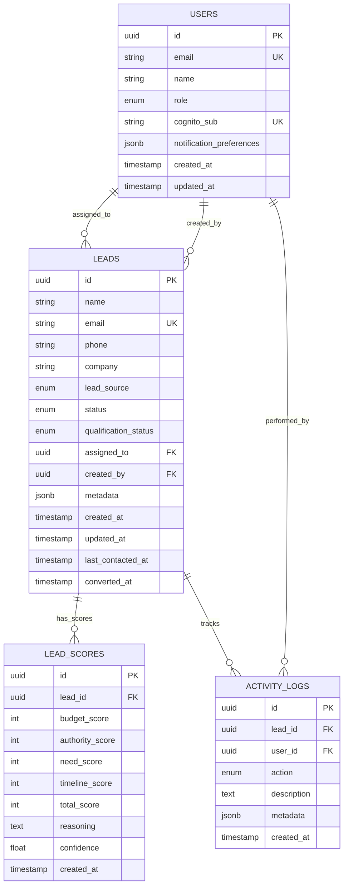

# Data Model: Lead Management with AI Qualification

**Feature**: Lead CRUD with AI Scoring (001-lead-crud-ai)
**Phase**: 1 - Design & Contracts
**Date**: 2025-12-31

## Entity Relationship Diagram



## Table Definitions

### 1. leads

**Purpose**: Core entity representing potential customers in the sales pipeline.

**Columns**:

| Column | Type | Constraints | Description |
|--------|------|-------------|-------------|
| `id` | UUID | PRIMARY KEY, DEFAULT gen_random_uuid() | Unique identifier for the lead |
| `name` | VARCHAR(255) | NOT NULL | Full name of the lead contact person |
| `email` | VARCHAR(255) | NOT NULL, UNIQUE | Email address (used as unique identifier) |
| `phone` | VARCHAR(20) | NULL | Phone number in E.164 format (e.g., +1234567890) |
| `company` | VARCHAR(255) | NULL | Company or organization name |
| `lead_source` | VARCHAR(50) | NOT NULL, CHECK (lead_source IN ('website', 'referral', 'ad', 'cold_outreach')) | Origin of the lead |
| `status` | VARCHAR(50) | NOT NULL, DEFAULT 'new', CHECK (status IN ('new', 'contacted', 'qualified', 'unqualified', 'converted')) | Current stage in sales pipeline |
| `qualification_status` | VARCHAR(50) | NOT NULL, DEFAULT 'not_qualified', CHECK (qualification_status IN ('not_qualified', 'in_progress', 'qualified', 'disqualified')) | AI qualification state |
| `assigned_to` | UUID | NULL, FOREIGN KEY REFERENCES users(id) ON DELETE SET NULL | Sales rep responsible for this lead |
| `created_by` | UUID | NOT NULL, FOREIGN KEY REFERENCES users(id) ON DELETE RESTRICT | User who created the lead |
| `metadata` | JSONB | NULL, DEFAULT '{}' | Custom fields, UTM parameters, tags |
| `created_at` | TIMESTAMP WITH TIME ZONE | NOT NULL, DEFAULT CURRENT_TIMESTAMP | Lead creation timestamp |
| `updated_at` | TIMESTAMP WITH TIME ZONE | NOT NULL, DEFAULT CURRENT_TIMESTAMP | Last modification timestamp |
| `last_contacted_at` | TIMESTAMP WITH TIME ZONE | NULL | Timestamp of last contact attempt |
| `converted_at` | TIMESTAMP WITH TIME ZONE | NULL | Timestamp when status changed to 'converted' |

**Indexes**:
```sql
CREATE INDEX idx_leads_email ON leads(email);
CREATE INDEX idx_leads_status_created ON leads(status, created_at DESC);
CREATE INDEX idx_leads_assigned_status ON leads(assigned_to, status) WHERE assigned_to IS NOT NULL;
CREATE INDEX idx_leads_qualification_status ON leads(qualification_status);
CREATE INDEX idx_leads_lead_source ON leads(lead_source);
CREATE INDEX idx_leads_created_at ON leads(created_at DESC);
CREATE INDEX idx_leads_metadata_gin ON leads USING gin(metadata); -- For JSON queries
```

**Triggers**:
```sql
-- Auto-update updated_at on row modification
CREATE TRIGGER update_leads_updated_at
BEFORE UPDATE ON leads
FOR EACH ROW
EXECUTE FUNCTION update_updated_at_column();

-- Set last_contacted_at when status changes to contacted/qualified/converted
CREATE TRIGGER update_last_contacted_at
BEFORE UPDATE ON leads
FOR EACH ROW
WHEN (NEW.status IN ('contacted', 'qualified', 'converted') AND OLD.status <> NEW.status)
EXECUTE FUNCTION update_last_contacted_at_column();

-- Set converted_at when status changes to converted
CREATE TRIGGER update_converted_at
BEFORE UPDATE ON leads
FOR EACH ROW
WHEN (NEW.status = 'converted' AND OLD.status <> 'converted')
EXECUTE FUNCTION update_converted_at_column();
```

**Business Rules**:
- Email must be unique across all leads (duplicate prevention per FR-003)
- Phone must be in E.164 format if provided (validation in application layer)
- `assigned_to` can be NULL (unassigned leads per clarification)
- `metadata` stores flexible custom fields without schema changes
- `updated_at` automatically updates on every modification
- `last_contacted_at` auto-updates when status changes to contacted/qualified/converted
- `converted_at` auto-updates when status changes to converted (one-way transition)

---

### 2. lead_scores

**Purpose**: Historical record of AI-generated BANT qualification scores for leads.

**Columns**:

| Column | Type | Constraints | Description |
|--------|------|-------------|-------------|
| `id` | UUID | PRIMARY KEY, DEFAULT gen_random_uuid() | Unique identifier for the score record |
| `lead_id` | UUID | NOT NULL, FOREIGN KEY REFERENCES leads(id) ON DELETE CASCADE | Associated lead |
| `budget_score` | INTEGER | NOT NULL, CHECK (budget_score BETWEEN 0 AND 25) | Budget fit score (0-25 points) |
| `authority_score` | INTEGER | NOT NULL, CHECK (authority_score BETWEEN 0 AND 25) | Authority/decision-maker score (0-25 points) |
| `need_score` | INTEGER | NOT NULL, CHECK (need_score BETWEEN 0 AND 25) | Need/pain point score (0-25 points) |
| `timeline_score` | INTEGER | NOT NULL, CHECK (timeline_score BETWEEN 0 AND 25) | Purchase timeline score (0-25 points) |
| `total_score` | INTEGER | GENERATED ALWAYS AS (budget_score + authority_score + need_score + timeline_score) STORED | Total BANT score (0-100) |
| `reasoning` | TEXT | NOT NULL | AI-generated explanation of the scores |
| `confidence` | DECIMAL(3,2) | NOT NULL, CHECK (confidence BETWEEN 0.00 AND 1.00) | AI confidence in scoring (0.0-1.0) |
| `created_at` | TIMESTAMP WITH TIME ZONE | NOT NULL, DEFAULT CURRENT_TIMESTAMP | Scoring timestamp |

**Indexes**:
```sql
CREATE INDEX idx_lead_scores_lead_id ON lead_scores(lead_id, created_at DESC);
CREATE INDEX idx_lead_scores_total_score ON lead_scores(total_score DESC);
CREATE INDEX idx_lead_scores_created_at ON lead_scores(created_at DESC);
```

**Business Rules**:
- Each BANT category score must be 0-25 (enforced by CHECK constraint per FR-017)
- `total_score` is computed automatically (sum of 4 categories, range 0-100)
- One lead can have multiple scores over time (historical tracking per User Story 4, scenario 3)
- Cascade delete when parent lead is deleted (cleanup per FR-023)
- `confidence` represents AI certainty (0.0 = guessing, 1.0 = very confident)
- Latest score for a lead is determined by MAX(created_at) in application layer

---

### 3. users

**Purpose**: Sales team members with system access and role-based permissions.

**Columns**:

| Column | Type | Constraints | Description |
|--------|------|-------------|-------------|
| `id` | UUID | PRIMARY KEY, DEFAULT gen_random_uuid() | Unique identifier for the user |
| `email` | VARCHAR(255) | NOT NULL, UNIQUE | Email address (login credential) |
| `name` | VARCHAR(255) | NOT NULL | Full name of the user |
| `role` | VARCHAR(50) | NOT NULL, CHECK (role IN ('admin', 'manager', 'sales_rep')) | Permission level |
| `cognito_sub` | VARCHAR(255) | NOT NULL, UNIQUE | AWS Cognito user sub (authentication reference) |
| `notification_preferences` | JSONB | NULL, DEFAULT '{"email": true, "sms": false, "in_app": true}' | Notification settings |
| `created_at` | TIMESTAMP WITH TIME ZONE | NOT NULL, DEFAULT CURRENT_TIMESTAMP | User creation timestamp |
| `updated_at` | TIMESTAMP WITH TIME ZONE | NOT NULL, DEFAULT CURRENT_TIMESTAMP | Last modification timestamp |

**Indexes**:
```sql
CREATE INDEX idx_users_email ON users(email);
CREATE INDEX idx_users_cognito_sub ON users(cognito_sub);
CREATE INDEX idx_users_role ON users(role);
```

**Triggers**:
```sql
-- Auto-update updated_at on row modification
CREATE TRIGGER update_users_updated_at
BEFORE UPDATE ON users
FOR EACH ROW
EXECUTE FUNCTION update_updated_at_column();
```

**Business Rules**:
- Email and cognito_sub must be unique (one user per Cognito identity)
- Role determines RBAC permissions (per FR-013)
  - `admin`: Full access to all leads, can delete leads
  - `manager`: Access to leads assigned to their team, can assign leads
  - `sales_rep`: Access only to leads assigned to them, can create leads
- Notification preferences stored as JSON for flexibility (email/SMS/in-app toggles)
- Users cannot be deleted if they created leads (RESTRICT constraint on leads.created_by)

---

### 4. activity_logs

**Purpose**: Audit trail of all actions performed on leads for compliance and debugging.

**Columns**:

| Column | Type | Constraints | Description |
|--------|------|-------------|-------------|
| `id` | UUID | PRIMARY KEY, DEFAULT gen_random_uuid() | Unique identifier for the log entry |
| `lead_id` | UUID | NULL, FOREIGN KEY REFERENCES leads(id) ON DELETE CASCADE | Associated lead (NULL for user-level actions) |
| `user_id` | UUID | NOT NULL, FOREIGN KEY REFERENCES users(id) ON DELETE RESTRICT | User who performed the action |
| `action` | VARCHAR(50) | NOT NULL, CHECK (action IN ('create', 'update', 'delete', 'qualify', 'assign', 'view')) | Type of action performed |
| `description` | TEXT | NOT NULL | Human-readable description of the action |
| `metadata` | JSONB | NULL, DEFAULT '{}' | Changed fields, previous values, additional context |
| `created_at` | TIMESTAMP WITH TIME ZONE | NOT NULL, DEFAULT CURRENT_TIMESTAMP | Action timestamp |

**Indexes**:
```sql
CREATE INDEX idx_activity_logs_lead_id ON activity_logs(lead_id, created_at DESC);
CREATE INDEX idx_activity_logs_user_id ON activity_logs(user_id, created_at DESC);
CREATE INDEX idx_activity_logs_action ON activity_logs(action, created_at DESC);
CREATE INDEX idx_activity_logs_created_at ON activity_logs(created_at DESC);
```

**Business Rules**:
- Cascade delete when parent lead is deleted (cleanup per FR-023)
- Users cannot be deleted if they have activity logs (RESTRICT constraint)
- Retention: 7 years for audit compliance (per Constitution IX)
- Metadata stores changed fields: `{"changedFields": ["status"], "previousValues": {"status": "new"}, "newValues": {"status": "contacted"}}`
- Actions are logged automatically via triggers or application layer (per FR-024)

**Example Metadata**:
```json
{
  "changedFields": ["status", "assigned_to"],
  "previousValues": {
    "status": "new",
    "assigned_to": null
  },
  "newValues": {
    "status": "contacted",
    "assigned_to": "user-uuid-123"
  },
  "reason": "Initial contact via phone call",
  "gdpr_request": false
}
```

---

## Relationships

### One-to-Many Relationships

1. **users → leads (assigned_to)**
   - One user can be assigned to many leads
   - A lead can have zero or one assigned user (NULL = unassigned)
   - ON DELETE SET NULL (if user deleted, leads become unassigned)

2. **users → leads (created_by)**
   - One user can create many leads
   - Every lead must have a creator
   - ON DELETE RESTRICT (cannot delete user who created leads)

3. **leads → lead_scores**
   - One lead can have many scores over time (historical tracking)
   - A score belongs to exactly one lead
   - ON DELETE CASCADE (delete scores when lead is deleted)

4. **users → activity_logs**
   - One user can perform many actions
   - Every log entry must have a user
   - ON DELETE RESTRICT (cannot delete user with audit logs)

5. **leads → activity_logs**
   - One lead can have many log entries
   - A log entry can reference zero or one lead (NULL for user-level actions)
   - ON DELETE CASCADE (delete logs when lead is deleted)

---

## Validation Rules

### Application-Layer Validation

**Lead Creation (POST /api/v1/leads)**:
```typescript
interface CreateLeadRequest {
  name: string;          // Required, 1-255 chars, no leading/trailing whitespace
  email: string;         // Required, valid email format (RFC 5322), lowercase
  phone?: string;        // Optional, E.164 format: /^\+[1-9]\d{1,14}$/
  company?: string;      // Optional, 1-255 chars
  leadSource: 'website' | 'referral' | 'ad' | 'cold_outreach'; // Required
  metadata?: Record<string, any>; // Optional, valid JSON object
}

// Validation rules (per FR-002)
const schema = {
  name: { required: true, minLength: 1, maxLength: 255, trim: true },
  email: { required: true, format: 'email', lowercase: true },
  phone: { optional: true, pattern: /^\+[1-9]\d{1,14}$/ },
  company: { optional: true, maxLength: 255 },
  leadSource: { required: true, enum: ['website', 'referral', 'ad', 'cold_outreach'] },
  metadata: { optional: true, type: 'object' }
};
```

**Lead Update (PATCH /api/v1/leads/:id)**:
```typescript
interface UpdateLeadRequest {
  name?: string;
  email?: string;
  phone?: string;
  company?: string;
  status?: 'new' | 'contacted' | 'qualified' | 'unqualified' | 'converted';
  assigned_to?: string | null; // UUID or null to unassign
  metadata?: Record<string, any>;
}

// Validation rules (per FR-010)
// Same as create, but all fields optional
// Additional rule: email uniqueness check if email is being changed
```

**Lead Qualification (POST /api/v1/leads/:id/qualify)**:
```typescript
interface QualifyLeadRequest {
  // No request body (uses existing lead data + conversation history)
}

interface QualifyLeadResponse {
  leadScore: {
    id: string;
    budget_score: number;    // 0-25
    authority_score: number; // 0-25
    need_score: number;      // 0-25
    timeline_score: number;  // 0-25
    total_score: number;     // 0-100 (computed)
    reasoning: string;
    confidence: number;      // 0.0-1.0
    created_at: string;
  };
  lead: {
    id: string;
    qualification_status: 'qualified' | 'disqualified' | 'in_progress';
    // ... other lead fields
  };
}

// Validation rules (per FR-016, FR-017, FR-018)
// - All scores must be 0-25
// - total_score = budget + authority + need + timeline
// - qualification_status: >= 60 = qualified, < 40 = disqualified, 40-59 = in_progress
```

---

## Database Schema Migration

### Initial Migration (V001)

```sql
-- Enable UUID extension
CREATE EXTENSION IF NOT EXISTS "uuid-ossp";

-- Create update_updated_at_column function
CREATE OR REPLACE FUNCTION update_updated_at_column()
RETURNS TRIGGER AS $$
BEGIN
    NEW.updated_at = CURRENT_TIMESTAMP;
    RETURN NEW;
END;
$$ LANGUAGE plpgsql;

-- Create update_last_contacted_at_column function
CREATE OR REPLACE FUNCTION update_last_contacted_at_column()
RETURNS TRIGGER AS $$
BEGIN
    IF NEW.status IN ('contacted', 'qualified', 'converted') AND
       OLD.status <> NEW.status THEN
        NEW.last_contacted_at = CURRENT_TIMESTAMP;
    END IF;
    RETURN NEW;
END;
$$ LANGUAGE plpgsql;

-- Create update_converted_at_column function
CREATE OR REPLACE FUNCTION update_converted_at_column()
RETURNS TRIGGER AS $$
BEGIN
    IF NEW.status = 'converted' AND OLD.status <> 'converted' THEN
        NEW.converted_at = CURRENT_TIMESTAMP;
    END IF;
    RETURN NEW;
END;
$$ LANGUAGE plpgsql;

-- Create users table
CREATE TABLE users (
    id UUID PRIMARY KEY DEFAULT gen_random_uuid(),
    email VARCHAR(255) NOT NULL UNIQUE,
    name VARCHAR(255) NOT NULL,
    role VARCHAR(50) NOT NULL CHECK (role IN ('admin', 'manager', 'sales_rep')),
    cognito_sub VARCHAR(255) NOT NULL UNIQUE,
    notification_preferences JSONB DEFAULT '{"email": true, "sms": false, "in_app": true}',
    created_at TIMESTAMP WITH TIME ZONE NOT NULL DEFAULT CURRENT_TIMESTAMP,
    updated_at TIMESTAMP WITH TIME ZONE NOT NULL DEFAULT CURRENT_TIMESTAMP
);

CREATE INDEX idx_users_email ON users(email);
CREATE INDEX idx_users_cognito_sub ON users(cognito_sub);
CREATE INDEX idx_users_role ON users(role);

CREATE TRIGGER update_users_updated_at
BEFORE UPDATE ON users
FOR EACH ROW
EXECUTE FUNCTION update_updated_at_column();

-- Create leads table
CREATE TABLE leads (
    id UUID PRIMARY KEY DEFAULT gen_random_uuid(),
    name VARCHAR(255) NOT NULL,
    email VARCHAR(255) NOT NULL UNIQUE,
    phone VARCHAR(20),
    company VARCHAR(255),
    lead_source VARCHAR(50) NOT NULL CHECK (lead_source IN ('website', 'referral', 'ad', 'cold_outreach')),
    status VARCHAR(50) NOT NULL DEFAULT 'new' CHECK (status IN ('new', 'contacted', 'qualified', 'unqualified', 'converted')),
    qualification_status VARCHAR(50) NOT NULL DEFAULT 'not_qualified' CHECK (qualification_status IN ('not_qualified', 'in_progress', 'qualified', 'disqualified')),
    assigned_to UUID REFERENCES users(id) ON DELETE SET NULL,
    created_by UUID NOT NULL REFERENCES users(id) ON DELETE RESTRICT,
    metadata JSONB DEFAULT '{}',
    created_at TIMESTAMP WITH TIME ZONE NOT NULL DEFAULT CURRENT_TIMESTAMP,
    updated_at TIMESTAMP WITH TIME ZONE NOT NULL DEFAULT CURRENT_TIMESTAMP,
    last_contacted_at TIMESTAMP WITH TIME ZONE,
    converted_at TIMESTAMP WITH TIME ZONE
);

CREATE INDEX idx_leads_email ON leads(email);
CREATE INDEX idx_leads_status_created ON leads(status, created_at DESC);
CREATE INDEX idx_leads_assigned_status ON leads(assigned_to, status) WHERE assigned_to IS NOT NULL;
CREATE INDEX idx_leads_qualification_status ON leads(qualification_status);
CREATE INDEX idx_leads_lead_source ON leads(lead_source);
CREATE INDEX idx_leads_created_at ON leads(created_at DESC);
CREATE INDEX idx_leads_metadata_gin ON leads USING gin(metadata);

CREATE TRIGGER update_leads_updated_at
BEFORE UPDATE ON leads
FOR EACH ROW
EXECUTE FUNCTION update_updated_at_column();

CREATE TRIGGER update_last_contacted_at
BEFORE UPDATE ON leads
FOR EACH ROW
WHEN (NEW.status IN ('contacted', 'qualified', 'converted') AND OLD.status <> NEW.status)
EXECUTE FUNCTION update_last_contacted_at_column();

CREATE TRIGGER update_converted_at
BEFORE UPDATE ON leads
FOR EACH ROW
WHEN (NEW.status = 'converted' AND OLD.status <> 'converted')
EXECUTE FUNCTION update_converted_at_column();

-- Create lead_scores table
CREATE TABLE lead_scores (
    id UUID PRIMARY KEY DEFAULT gen_random_uuid(),
    lead_id UUID NOT NULL REFERENCES leads(id) ON DELETE CASCADE,
    budget_score INTEGER NOT NULL CHECK (budget_score BETWEEN 0 AND 25),
    authority_score INTEGER NOT NULL CHECK (authority_score BETWEEN 0 AND 25),
    need_score INTEGER NOT NULL CHECK (need_score BETWEEN 0 AND 25),
    timeline_score INTEGER NOT NULL CHECK (timeline_score BETWEEN 0 AND 25),
    total_score INTEGER GENERATED ALWAYS AS (budget_score + authority_score + need_score + timeline_score) STORED,
    reasoning TEXT NOT NULL,
    confidence DECIMAL(3,2) NOT NULL CHECK (confidence BETWEEN 0.00 AND 1.00),
    created_at TIMESTAMP WITH TIME ZONE NOT NULL DEFAULT CURRENT_TIMESTAMP
);

CREATE INDEX idx_lead_scores_lead_id ON lead_scores(lead_id, created_at DESC);
CREATE INDEX idx_lead_scores_total_score ON lead_scores(total_score DESC);
CREATE INDEX idx_lead_scores_created_at ON lead_scores(created_at DESC);

-- Create activity_logs table
CREATE TABLE activity_logs (
    id UUID PRIMARY KEY DEFAULT gen_random_uuid(),
    lead_id UUID REFERENCES leads(id) ON DELETE CASCADE,
    user_id UUID NOT NULL REFERENCES users(id) ON DELETE RESTRICT,
    action VARCHAR(50) NOT NULL CHECK (action IN ('create', 'update', 'delete', 'qualify', 'assign', 'view')),
    description TEXT NOT NULL,
    metadata JSONB DEFAULT '{}',
    created_at TIMESTAMP WITH TIME ZONE NOT NULL DEFAULT CURRENT_TIMESTAMP
);

CREATE INDEX idx_activity_logs_lead_id ON activity_logs(lead_id, created_at DESC);
CREATE INDEX idx_activity_logs_user_id ON activity_logs(user_id, created_at DESC);
CREATE INDEX idx_activity_logs_action ON activity_logs(action, created_at DESC);
CREATE INDEX idx_activity_logs_created_at ON activity_logs(created_at DESC);
```

---

## TypeScript Model Definitions

### Lead Model

```typescript
// backend/src/models/Lead.ts
import { Pool } from 'pg';

export enum LeadSource {
  WEBSITE = 'website',
  REFERRAL = 'referral',
  AD = 'ad',
  COLD_OUTREACH = 'cold_outreach'
}

export enum LeadStatus {
  NEW = 'new',
  CONTACTED = 'contacted',
  QUALIFIED = 'qualified',
  UNQUALIFIED = 'unqualified',
  CONVERTED = 'converted'
}

export enum QualificationStatus {
  NOT_QUALIFIED = 'not_qualified',
  IN_PROGRESS = 'in_progress',
  QUALIFIED = 'qualified',
  DISQUALIFIED = 'disqualified'
}

export interface Lead {
  id: string;
  name: string;
  email: string;
  phone?: string;
  company?: string;
  lead_source: LeadSource;
  status: LeadStatus;
  qualification_status: QualificationStatus;
  assigned_to?: string;
  created_by: string;
  metadata: Record<string, any>;
  created_at: Date;
  updated_at: Date;
  last_contacted_at?: Date;
  converted_at?: Date;
}

export interface CreateLeadInput {
  name: string;
  email: string;
  phone?: string;
  company?: string;
  lead_source: LeadSource;
  metadata?: Record<string, any>;
  created_by: string;
}

export interface UpdateLeadInput {
  name?: string;
  email?: string;
  phone?: string;
  company?: string;
  status?: LeadStatus;
  assigned_to?: string | null;
  metadata?: Record<string, any>;
}
```

### LeadScore Model

```typescript
// backend/src/models/LeadScore.ts
export interface LeadScore {
  id: string;
  lead_id: string;
  budget_score: number;      // 0-25
  authority_score: number;   // 0-25
  need_score: number;        // 0-25
  timeline_score: number;    // 0-25
  total_score: number;       // 0-100 (computed)
  reasoning: string;
  confidence: number;        // 0.0-1.0
  created_at: Date;
}

export interface CreateLeadScoreInput {
  lead_id: string;
  budget_score: number;
  authority_score: number;
  need_score: number;
  timeline_score: number;
  reasoning: string;
  confidence: number;
}
```

### User Model

```typescript
// backend/src/models/User.ts
export enum UserRole {
  ADMIN = 'admin',
  MANAGER = 'manager',
  SALES_REP = 'sales_rep'
}

export interface User {
  id: string;
  email: string;
  name: string;
  role: UserRole;
  cognito_sub: string;
  notification_preferences: {
    email: boolean;
    sms: boolean;
    in_app: boolean;
  };
  created_at: Date;
  updated_at: Date;
}
```

### ActivityLog Model

```typescript
// backend/src/models/ActivityLog.ts
export enum ActivityAction {
  CREATE = 'create',
  UPDATE = 'update',
  DELETE = 'delete',
  QUALIFY = 'qualify',
  ASSIGN = 'assign',
  VIEW = 'view'
}

export interface ActivityLog {
  id: string;
  lead_id?: string;
  user_id: string;
  action: ActivityAction;
  description: string;
  metadata: Record<string, any>;
  created_at: Date;
}

export interface CreateActivityLogInput {
  lead_id?: string;
  user_id: string;
  action: ActivityAction;
  description: string;
  metadata?: Record<string, any>;
}
```

---

## Query Examples

### Get Lead with Latest Score

```typescript
async function getLeadWithScore(leadId: string): Promise<Lead & { leadScore?: LeadScore }> {
  const query = `
    SELECT
      l.*,
      ls.id AS score_id,
      ls.budget_score,
      ls.authority_score,
      ls.need_score,
      ls.timeline_score,
      ls.total_score,
      ls.reasoning,
      ls.confidence,
      ls.created_at AS score_created_at
    FROM leads l
    LEFT JOIN LATERAL (
      SELECT * FROM lead_scores
      WHERE lead_id = l.id
      ORDER BY created_at DESC
      LIMIT 1
    ) ls ON true
    WHERE l.id = $1
  `;

  const result = await pool.query(query, [leadId]);
  // Transform result into Lead + LeadScore objects
}
```

### List Leads with Filters and Pagination

```typescript
async function listLeads(filters: {
  status?: LeadStatus;
  qualification_status?: QualificationStatus;
  lead_source?: LeadSource;
  assigned_to?: string;
  search?: string;
  page?: number;
  limit?: number;
  sortBy?: string;
  sortOrder?: 'asc' | 'desc';
}): Promise<{ data: Lead[]; total: number }> {
  const { page = 1, limit = 20, sortBy = 'created_at', sortOrder = 'desc' } = filters;
  const offset = (page - 1) * limit;

  const conditions: string[] = [];
  const params: any[] = [];
  let paramIndex = 1;

  if (filters.status) {
    conditions.push(`status = $${paramIndex++}`);
    params.push(filters.status);
  }

  if (filters.qualification_status) {
    conditions.push(`qualification_status = $${paramIndex++}`);
    params.push(filters.qualification_status);
  }

  if (filters.lead_source) {
    conditions.push(`lead_source = $${paramIndex++}`);
    params.push(filters.lead_source);
  }

  if (filters.assigned_to) {
    conditions.push(`assigned_to = $${paramIndex++}`);
    params.push(filters.assigned_to);
  }

  if (filters.search) {
    conditions.push(`(name ILIKE $${paramIndex} OR company ILIKE $${paramIndex} OR email ILIKE $${paramIndex})`);
    params.push(`%${filters.search}%`);
    paramIndex++;
  }

  const whereClause = conditions.length > 0 ? `WHERE ${conditions.join(' AND ')}` : '';

  const query = `
    SELECT * FROM leads
    ${whereClause}
    ORDER BY ${sortBy} ${sortOrder}
    LIMIT $${paramIndex++} OFFSET $${paramIndex++}
  `;
  params.push(limit, offset);

  const countQuery = `SELECT COUNT(*) FROM leads ${whereClause}`;

  const [dataResult, countResult] = await Promise.all([
    pool.query(query, params),
    pool.query(countQuery, params.slice(0, -2))
  ]);

  return {
    data: dataResult.rows,
    total: parseInt(countResult.rows[0].count)
  };
}
```

---

## Archival Strategy (90-Day Inactive Leads)

**Requirement**: Archive leads to S3 Glacier after 90 days of inactivity (per FR-036 and clarification)

**Implementation**:
1. **Scheduled Job**: EventBridge rule triggers Lambda daily
2. **Identify Inactive**: Query leads where `updated_at < NOW() - INTERVAL '90 days'` AND `qualification_status = 'not_qualified'` AND `status = 'new'`
3. **Export to S3**: Serialize lead + related records (scores, activity logs) to JSON, upload to S3 Glacier
4. **Mark Archived**: Add `archived_at` timestamp to leads table (future migration), or move to separate `archived_leads` table
5. **Retain Metadata**: Keep lead ID and email in hot storage for duplicate detection, full data in Glacier

**Query for Archival Candidates**:
```sql
SELECT id, name, email, company, created_at, updated_at
FROM leads
WHERE updated_at < NOW() - INTERVAL '90 days'
  AND qualification_status = 'not_qualified'
  AND status = 'new'
  AND archived_at IS NULL;
```

---

**Next Phase**: See [contracts/](./contracts/) for OpenAPI specifications and [quickstart.md](./quickstart.md) for local development setup.
